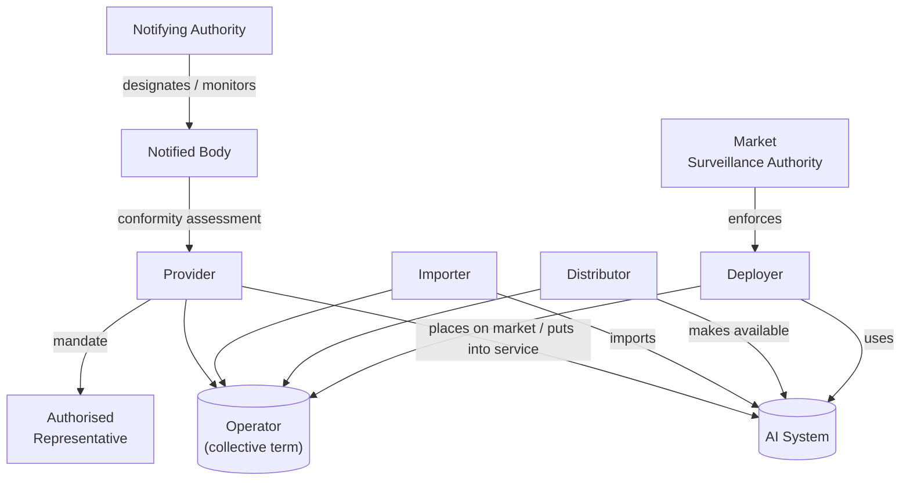

# The EU AI Act – Unveiling Lesser-Known Aspects, Implementation Entities & Exemptions

*Conference / Location – 2025*
*Speaker: Your Name*

---

## Slide 1  Title & Opening
- Title, speaker name, affiliation, date.

**Speaker notes:** Brief self-intro; hook with a headline about the AI Act already banning some systems today (Art. 5 applies 6 months after entry into force; Art. 112(2)).

---

## Slide 2  Agenda & Talk Objectives
1. Act in a nutshell & timeline  
2. Risk-based structure  
3. What is already illegal  
4. Lesser-known exemptions  
5. Who enforces & how  
6. Opportunities for the private sector  
7. Take-aways & discussion

**Refs:** Art. 1–2 scope; Art. 112–113 timing.

---

## Slide 3  Where Are We in the Legislative Timeline?
- Political agreement: 9 Dec 2023  
- Formal adoption: Regulation (EU) 2024/1689 (OJEU 13 Jun 2024)  
- Entry into force: 2 July 2024 (20 days after publication) (Art. 113)  
- Key applicability milestones:  
  • Prohibitions → 6 months (Jan 2025) (Art. 112(2))  
  • Governance chapters & Board → 12 months  
  • High-risk obligations → 36 months  
  • Sandboxes → 6 months

**Speaker notes:** Stress that some AI is already banned; most obligations start mid-2027.

---

## Slide 4  Risk-Based Structure of the Act
 <!-- placeholder -->

- Prohibited ("unacceptable risk") – Art. 5  
- High-risk – Art. 6 & Annex III  
- Limited-risk (transparency duties) – Art. 52  
- Minimal-risk (free use)

**Ref:** Recitals 5–16 outline risk logic.

---

## Slide 5  Prohibited AI Practices (Already in Force Jan 2025)
- Manipulative or subliminal techniques causing significant harm (Art. 5(1)(a), Rec. 30-31)
- Exploitation of vulnerabilities of a specific group (Art. 5(1)(b))
- Biometric categorisation inferring sensitive traits (Art. 5(1)(c))
- Social scoring by public authorities (Art. 5(1)(d))
- Real-time remote biometric identification in public spaces (with narrow judicial exceptions) (Art. 5(1)(e) + Art. 5(2))

**Speaker notes:** Give concrete examples; link to public debates on social credit, emotion recognition.

---

## Slide 6  High-Risk AI Systems – Where Most Compliance Work Lies
Two cumulative criteria (Art. 6):
1. Intended purpose listed in Annex III (1-8)
2. System is safety component or standalone with significant risk.

Key domains (Annex III):
1. Biometrics & identification
2. Critical infrastructure
3. Education & vocational training
4. Employment & worker management
5. Essential private & public services (credit, benefits)
6. Law enforcement
7. Migration, asylum & border control
8. Administration of justice & democratic processes

---

## Slide 7  Obligations for High-Risk Providers & Deployers
✔ Risk-management system (Art. 9)  
✔ High-quality data & governance (Art. 10)  
✔ Technical documentation (Art. 11)  
✔ Record-keeping (Art. 12)  
✔ Transparency & instructions (Art. 13)  
✔ Human oversight (Art. 14)  
✔ Robustness, accuracy, cybersecurity (Art. 15)  
✔ Post-market monitoring & incident reporting (Art. 16–17, 62)

**Speaker notes:** Map to typical AI lifecycle; stress that deployers (users) also have duties (Art. 24–29).

---

## Slide 8  Surprising Exemptions for Public-Sector Use
- **National security & military** outside scope (Art. 2(3)(a))
- **Law-enforcement** activities excluded when covered by secrecy/confidentiality & for criminal investigations (Art. 2(3)(b), Rec. 13-15)
- **Border-control & asylum** risk categories exist, yet substantial derogations (Art. 6(2), Annex III(7), Art. 83-85)

**Example:** Predictive policing tools used by police may be exempt if for serious crime investigation.

---

## Slide 9  Case Study: Remote Biometric ID by Police
- Generally prohibited in real time (Art. 5(1)(e))
- BUT Member States may authorise use *after* judicial/administrative order for:
  • Victim search (Art. 5(2)(a))  
  • Imminent terrorist threat (Art. 5(2)(b))  
  • Serious crime suspect identification (Art. 5(2)(c))

**Speaker notes:** Highlight debate on proportionality & fundamental rights.

---

## Slide 10  Governance Ecosystem – Who Does What?
| Entity | AI Act Article | Role |
| --- | --- | --- |
| European Artificial Intelligence Board | Art. 56-57 | Consistency, guidelines, dispute resolution |
| European Commission | Art. 63 | Secretariat; adopts implementing acts |
| National Supervisory Authorities | Art. 59 | Market surveillance, enforcement |
| Notifying Authorities | Art. 30 | Designate & monitor notified bodies |
| Notified Bodies | Art. 31 | Conformity assessment of high-risk AI |

---

## Slide 11  Notifying vs Notified Bodies – A Niche for Private Actors
- **Notifying authorities** = public bodies; ensure independence (Art. 30(2)).
- **Notified bodies** = accredited conformity-assessment organisations; can be private.  
- Must prove competence (Annex VII) and are listed in NANDO database.

**Opportunity:** SMEs and consultancies can become notified bodies or subcontract experts.

---

## Slide 12  Conformity Assessment Pathways
1. **Third-party assessment** by notified body (default) (Art. 43(1)).
2. **Internal control** for certain Annex III systems built on harmonised standards or CSRs (Art. 43(2)).
3. **Quality-management system certification** under Art. 44.

**Speaker notes:** Compare with CE-marking under product safety law.

---

## Slide 13  Regulatory Sandboxes – Test & Learn
- Definition: controlled environment set up by competent authority (Art. 53).
- Objectives: foster innovation while ensuring compliance & data protection.
- Participation open to startups, SMEs, academia.
- Duration max = 1 year (extendable).

**Refs:** Recitals 71-74; Art. 5 of the GDPR still applies (EDPB/EDPS guidance 2024).

---

## Slide 14  Private-Sector Engagement Map
- Become **notified body** or subcontractor
- Contribute to **European & international standards** (CEN/CENELEC JTC 21, ISO/IEC 42001)
- Join **sandboxes** to refine models & documentation
- Offer **compliance-as-a-service** tooling (model cards, audit pipelines)

---

## Slide 15  Road-Map to Compliance (Providers)
0. Gap analysis → today  
1. Design risk-management & QMS (ISO 42001)  
2. Build data governance pipelines  
3. Prepare technical file & logs  
4. Select notified body / assessment route  
5. CE-mark & EU declaration of conformity

**Timeline overlay:** 36 months until obligations apply → early movers gain trust advantage.

---

## Slide 16  Key Debates & Open Questions
- Enforcement capacity of national authorities
- Interplay with GDPR, DSA, sectoral law
- How to monitor post-market performance?
- Global alignment: overlaps with OECD, U.S. AI EO, ISO.

---

## Slide 17  Take-Aways
1. Some AI systems are *already* banned – check portfolios.
2. Exemptions leave a regulatory gap in sensitive public-sector uses.
3. New ecosystem (Board, notified bodies, sandboxes) will shape market entry.
4. Early compliance work = strategic advantage.

---

## Slide 18  Q & A

---

### Appendix / Backup Slides
- Full list of Annex III categories (screenshot)
- Detailed timeline graphic
- Links & resources

---

## References
1. Regulation (EU) 2024/1689 (AI Act) – Official Journal, 13 Jun 2024.  
2. AI Act Explorer: https://artificialintelligenceact.eu  
3. EDPB-EDPS Joint Opinion 5/2021;  
4. CEN-CENELEC JTC 21 WG; ISO/IEC 42001 AI MS standard.

Prohibition on manipulative AI practices
• Obligation – AI that “materially distorts human behaviour” causing significant harm is banned (Art. 5 §1 (a); Recital 30).
• Exemptions – • Lawful medical treatment (e.g. psychological therapy, rehabilitation) carried out under applicable law.
• “Common and legitimate commercial practices … in the field of advertising” that comply with other law (Recital 30).
Prohibition on exploiting vulnerabilities of a specific group
• Obligation – Banned under Art. 5 §1 (b). (No explicit exemption text observed in the chunks opened.)
Prohibition on biometric categorisation inferring sensitive traits
• Obligation – Art. 5 §1 (c); Recital 31.
• Exemption – Lawful labelling/filtering of biometric datasets gathered under Union or national law (e.g. sorting images by eye colour) (Recital 31).
Ban on social-scoring by public authorities
• Obligation – Art. 5 §1 (d). (No carve-out mentioned in text viewed.)
Ban on real-time remote biometric identification (RBI) in public spaces
• Obligation – Art. 5 §1 (e).
• Exemptions – Member State may authorise RBI after a judicial/administrative order strictly for:
a. Search for a specific victim (Art. 5 §2 (a))
b. Prevention of an imminent terrorist threat (Art. 5 §2 (b))
c. Identification of a suspect of a serious crime (Art. 5 §2 (c)); national rules must be notified to the Commission (Recital 38).
Scope exclusions (entire Regulation does not apply)
• Military, defence or national-security use of AI (Art. 2 §3 (a); Recital 25)
• Certain law-enforcement-only activities that fall under secrecy/confidentiality for criminal investigation (Art. 2 §3 (b); Recital 25, 38)
• AI systems “specifically developed and put into service for the sole purpose of scientific research and development” and other R&D activities before market placement (Recital 26).
High-risk classification rules
• Obligation – AI listed in Annex III is high-risk (Art. 6 §2).
• Exemptions – An Annex III system is not high-risk if it “does not pose a significant risk” and fulfils at least one of the narrow-task conditions (procedural, supportive, pattern-detection, preparatory) listed in Art. 6 §3 (a)–(d). Providers must document the assessment and register the system (Art. 6 §4).
Credit-scoring & essential-services AI (Recital 59)
• Obligation – Systems determining access to essential public benefits or creditworthiness are high-risk.
• Exemption – AI “provided for by Union law for the purpose of detecting fraud in the offering of financial services and for prudential purposes to calculate credit institutions’ and insurance undertakings’ capital requirements” is not considered high-risk.
Remote biometric identification outside law-enforcement context
• Obligation – RBI rules of Art. 5 apply lex specialis to law-enforcement uses (Recital 38).
• Exemption – RBI “for purposes other than law enforcement” is not subject to the Article 5 authorisation framework (same recital).
Data governance for high-risk systems
• Obligation – High-risk AI must use relevant, representative, error-free data and follow detailed governance practices (Art. 10 §§1-4).
• Limited derogation – Providers may exceptionally process special-category personal data only when needed to detect/correct bias and all safeguards of Art. 10 §5 (a)-(b) are met (Art. 10 §5).

---

### Exhaustive List of Explicit Exclusions / Exemptions (AI Act)

#### 1. Regulation Scope — Article 2
- **Art. 2 §3** – Regulation does not apply outside Union law and does not affect Member State competences for national security; AI used exclusively for military/defence/national-security purposes is fully excluded.
- **Art. 2 §4** – Excludes AI used by third-country public authorities or international organisations in law-enforcement/judicial cooperation with adequate fundamental-rights safeguards.
- **Art. 2 §5** – Leaves intact the intermediary-service liability regime of the Digital Services Act (Reg. 2022/2065).
- **Art. 2 §6** – AI systems or models developed and put into service solely for scientific research & development are excluded.
- **Art. 2 §8** – Excludes research, testing and development activities prior to market placement; real-world testing is not covered.
- **Art. 2 §10** – Deployers who are natural persons using AI for purely personal, non-professional activity are exempt.
- **Art. 2 §11** – Regulation is without prejudice to more protective worker-rights laws or collective agreements.
- **Art. 2 §12** – AI systems released under a free & open-source licence are exempt unless they are (i) high-risk, (ii) prohibited (Art. 5) or (iii) subject to Art. 50 transparency obligations.
- **Art. 2 §2** – For high-risk AI related to products covered by Union harmonisation legislation (Annex I Section B), only Articles 6(1), 102–109, 112 (and part of 57) apply.

#### 2. Prohibited Practices — Article 5 Carve-outs
- **Art. 5 §1(d)** – Ban on predictive risk-assessment AI does not apply to systems merely supporting a human assessment already based on objective and verifiable facts.
- **Art. 5 §2(a–c)** – Member States may authorise real-time remote biometric identification in public spaces strictly for (a) locating a specific victim, (b) preventing an imminent terrorist threat, or (c) identifying a suspect of a serious crime (Recitals 37–38).
- **Recital 30** – Manipulative-behaviour ban does not apply to lawful medical treatment or legitimate advertising practices compliant with marketing and consumer law.
- **Recital 31** – Biometric categorisation ban does not apply to lawful labelling/filtering of images lawfully collected.

#### 3. High-Risk Classification — Article 6
- **Art. 6 §§3–4** – An Annex III AI system is not high-risk if it poses no significant risk and meets at least one narrow-task condition (procedural, supportive, pattern-detection, preparatory). Provider must document and register the assessment.

#### 4. Data & Governance — Article 10
- **Art. 10 §5** – Limited derogation allows processing of special-category personal data for bias detection/correction under strict safeguards.

#### 5. Providers & Third Parties — Article 25
- **Art. 25 §2** – When a third party modifies an AI system into a high-risk system, the original provider’s obligations cease if the provider had forbidden such change.
- **Art. 25 §4** – Information-sharing duty does not apply to third parties making tools/components available under a free & open-source licence (except GPAI models).

#### 6. Transparency Duties — Article 50
- **Art. 50 §1** – Human-interaction notice not required if obvious or if system is authorised by law to combat crime (unless used for public crime reporting).
- **Art. 50 §2** – Watermarking of synthetic content not required for assistive standard editing or when authorised for criminal-law purposes.
- **Art. 50 §3** – Emotion-recognition / biometric-categorisation notice not required when system is authorised for criminal-law purposes.
- **Art. 50 §4** – Deep-fake disclosure not required when authorised for criminal-law purposes; artistic/creative/satirical/fictional works only need contextual disclosure.

#### 7. Registration — Article 49 §5
- High-risk AI systems in Annex III point 2 are registered nationally rather than in the EU database.

---

These points consolidate every explicit "does not apply", "shall not apply" or other exemption phrase found in Articles 2, 5, 6, 10, 25, 49, 50 and related recitals of Regulation (EU) 2024/1689.

---

# Test

graph TD;
    A-->B;
    A-->C;
    B-->D;
    C-->D;

<!-- mermaid.js -->

---

# EU AI Act – 5-Minute Overview

* First horizontal regulation on AI worldwide (Reg. (EU) 2024/1689)  
* Risk-based approach: Unacceptable → High-Risk → Limited → Minimal  
* Protects fundamental rights, health, safety & fosters innovation  
* Extraterritorial scope: applies to anyone placing AI on the EU market or affecting people in the EU  

---

## Legislative Timeline

| Milestone | Date |
|-----------|------|
| Commission proposal | 21 Apr 2021 |
| Council general approach | 6 Dec 2022 |
| Parliament position | 14 Jun 2023 |
| Political trilogue agreement | 9 Dec 2023 |
| Final adoption (Reg. 2024/1689) | 13 Mar 2024 |
| Entry into force | 11 Jun 2024 |
| Obligations kick-in | 2025 – 2027 (phased) |

---

## Who Has To Do What?

**Providers**  
• Risk management & data-governance system  
• Technical documentation, CE marking  
• Post-market monitoring & incident reporting  

**Deployers / Users**  
• Ensure human oversight & transparency  
• Keep logs, perform fundamental-rights impact assessments (public sector)  

**General-Purpose / Foundation Model Providers**  
• Publish model cards & test reports  
• Mitigate systemic risks, cooperate with the EU AI Office  

---

## Hot Topics & Challenges

⚖️  Biometric surveillance carve-outs vs. civil-rights concerns  
📜  Documentation burden on SMEs & open-source communities  
🤖  How to audit and sandbox large GPAI models  
🌍  "Brussels effect": global ripple on AI governance  
🏷️  Opportunity: booming demand for auditors, red-teamers & compliance tooling  

---

## Prohibited AI Practices (Art. 5 – What's Banned)

• Manipulative subliminal or deceptive AI that distorts behaviour & harms people  
• Exploiting vulnerabilities (age, disability, socio-economic) to distort behaviour & harm  
• Social-scoring systems causing unfair or disproportionate treatment  
• Predictive policing based solely on profiling/personality traits  
• Untargeted scraping of facial images to build recognition databases  
• Emotion recognition in workplaces or schools (unless for medical/safety)  
• Biometric categorisation inferring sensitive traits (race, religion, etc.)  
• Real-time remote biometric ID in public spaces by police (few narrow exceptions)  
